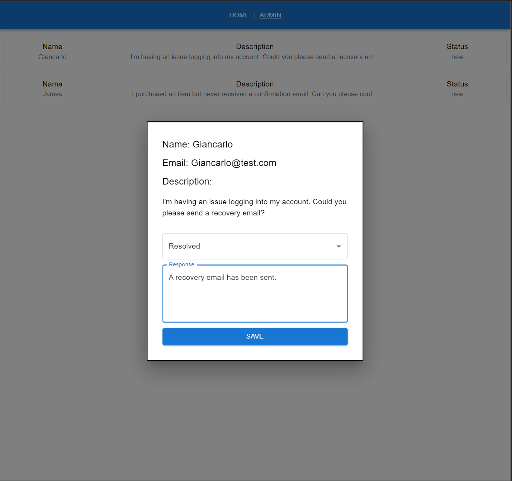

# Project Name

This is a help desk demo application. Client can submit a help desk ticket. Admin/staff can respond and edit the ticket's status.

## Screenshots





## Installation

clone repo

## To start the node server

```
cd help-desk-assessment-server
run npm install && npm run dev
```

## To spin up frontend environment

```
cd help-desk-assessment-client
run npm install && npm run dev
```

## Usage

Submit tickets. View and edit ticket.

## Acknowledgments

-I want to thank the team for the opportunity to interview!
